# mepwatch.eu
### informed citizens = better democracy
notes:
MEPwatch is about bringing data and facts back into European policits, and briging the gaps between citizens, campaigning organisations and politicians who represent all of us in the European Parliament.
What’s in this presentation:
- we go through the why we need this tool, what’s the purpose of it, who it’s for, and how to use it
---
# The crisis
#### European democracy at a crossroads

notes:
- citizens increasingly disconnected from EU policy making. 
- election turnout low. 
- fake news and voter manipulations on social media.
- euroscepticism on the rise. 
- corporate capture obscuring democratic processes.

---
# The solution
Democracy works if citizens are informed and engaged.

notes:
Technology and can **lower the barrier** to engaging meaningfully in European politics, make **information accessible** and easier to digest in a world where we’re overwhelmed with it at all times, **improve transparency** and make it easy for citizens to feed back and hold their representatives **accountable** for their promises  and their votes.

---

# The tool
mepwatch.eu is bringing facts back into European politics (just in time for the 2019 European election)

notes:
What we’re doing is providing a tool for campaigning organisations to get active, and get their constituencies *followers, subscribers, members* also active in European politics.

---
# The audience

<h3>I'm a campaigner</h3>
We help you find reliable and legible voting data to support your campaign, generate simple or complex scorecards for MEPs, and engage citizens in your campaign.

<h3>I'm a citizen</h3>
We make it easy to find who represents you, score the MEP based on solid voting data instead of electoral promises, and connect with your MEP ahead of the election.

notes:
There are 2 audiences and two distinct user journeys.
---
# The data
We analysed data for all MEPs in the 8th European Parliament's term 2014-2019.

  

    
7723 rollcalls

    
5109993 individual votes

  

  

    
158453 attendance records over 237 plenary sessions

    
28 sets of national geodata & postal codes

  

notes:
- MEPs data (country, party, twitter, email...)
- 8k rollcalls 
- 5M individual votes
- 158k attendance records over 237 plenary sessions
- national geodata and postal codes

---
# The app generator
### how it goes:

notes:
# how it goes
select votes --> analyse votes and generate the app --> customise information, call to action & template messages --> set it free --> learn

-- 
<h3>All rollcalls <a href="../votes.html" class="btn btn-primary" target="_blank">DEMO</h3>
[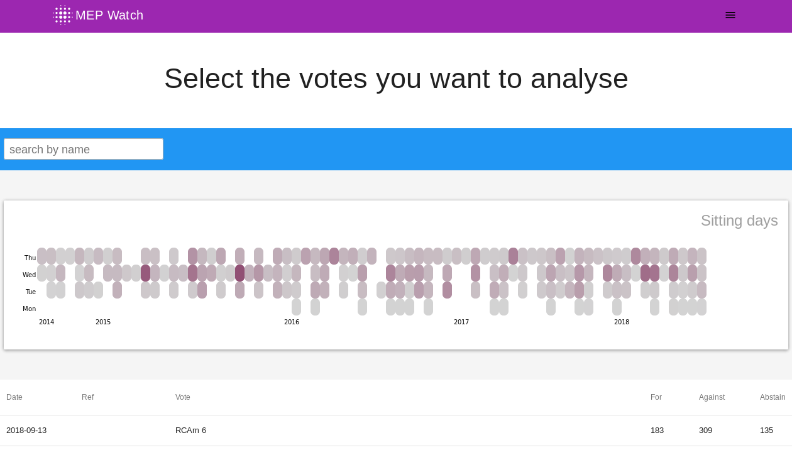](../votes.html)

Note:
first, the vote selection and analysis 
- let’s imagine I’m a campaigner at a pro-democracy NGO in Brussels and I want to analyse and megaphone a recent plenary vote about triggering the Art. 7 rule of law proceedings against Hungary
## to demonstrate
- choose sitting date second from top far right/or type Sargentini; click through to the widget
- widget presentation

# Article 7 Hungary
## overview, map & groups
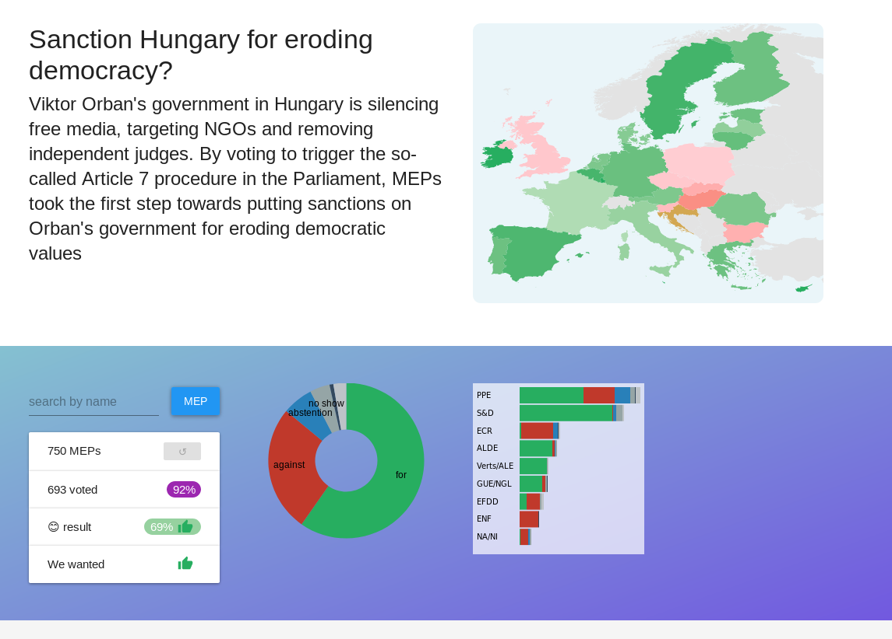

--
# Article 7 Hungary -2
## summary, groups and parties
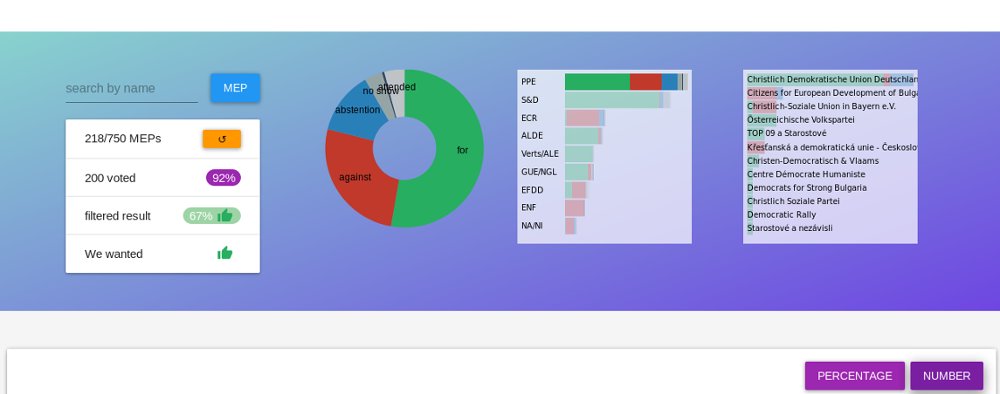
--
# Article 7 Hungary -3
## countries and MEPs
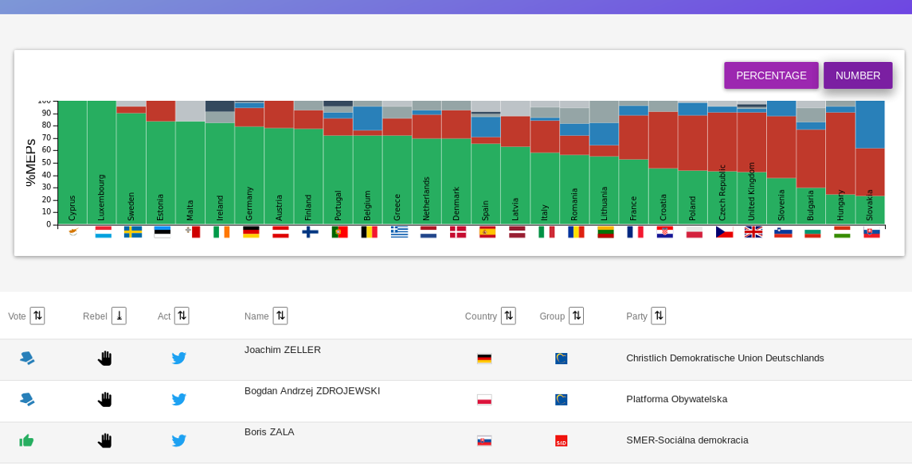

# edit
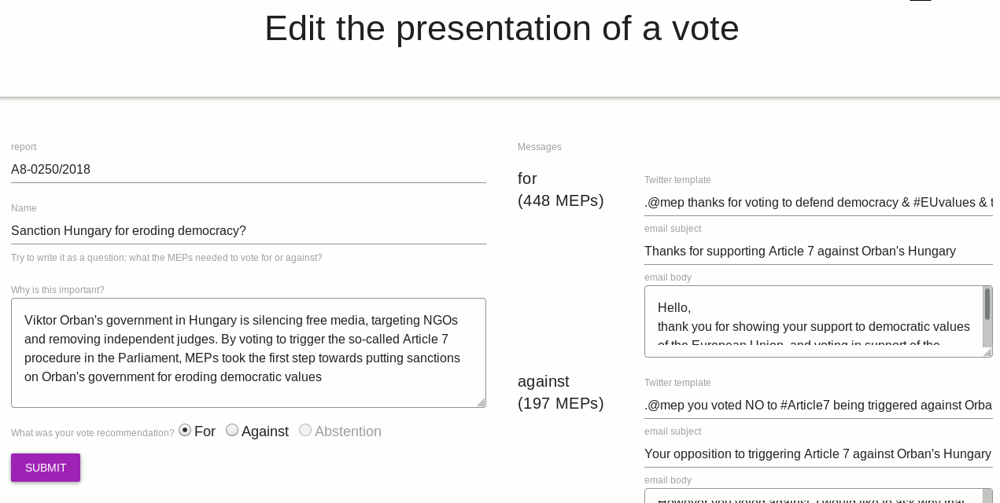
---
# The scorecard app
### how it goes:

notes:
be inspired --> select the country where you vote --> filter further --> contact the MEP

--
# Overview
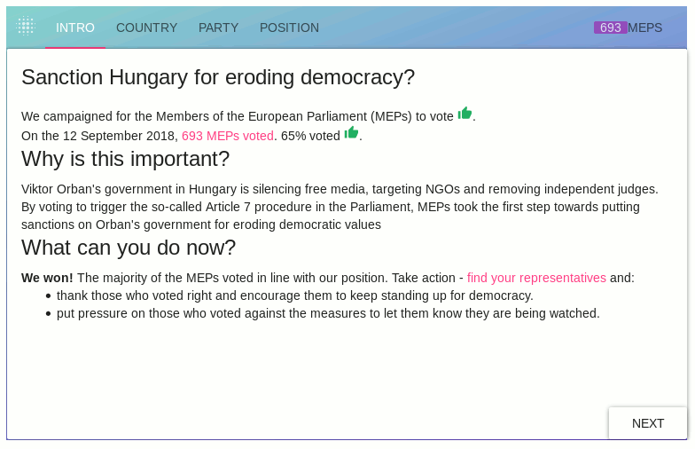

--
# Country
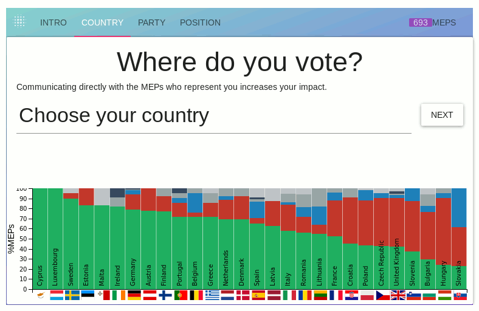

--
# Party 
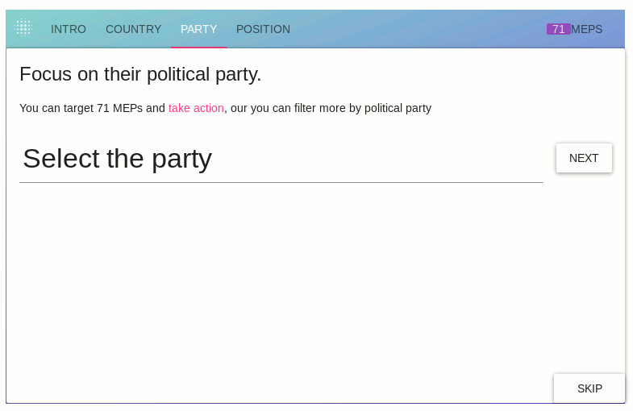

--
# Position
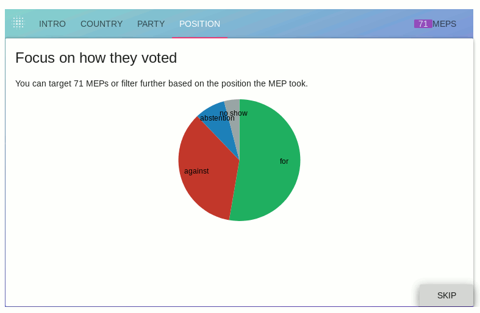

--
# MEPs
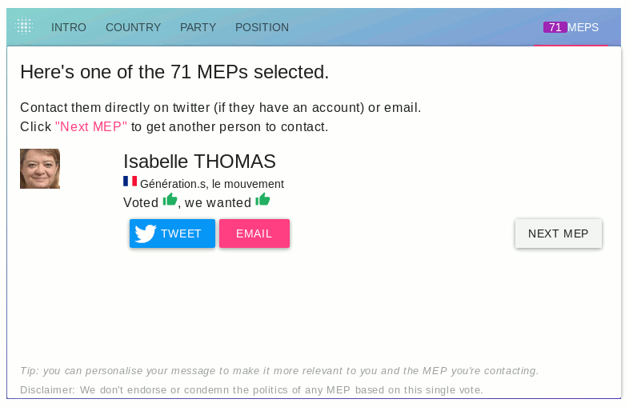

--
# Tweet
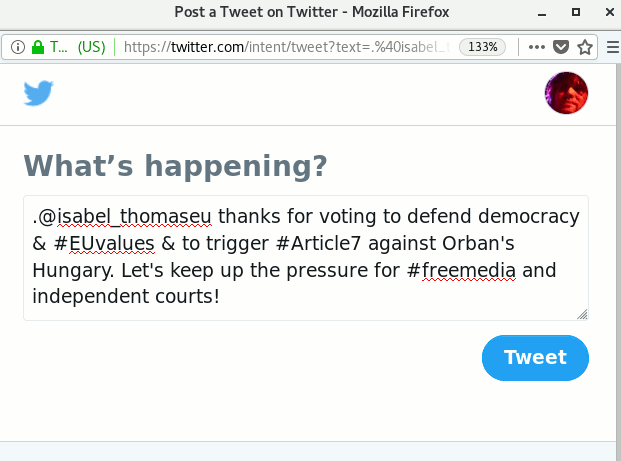

---
# The stages
1. single vote campaigns build engagement and pressure
2. learning and tweaking
3. complex multi-vote scorecards inform and engage citizens in pre-election campaigning

notes:
We are still a few months away from the elections and now is the time to activate citizens across the EU on some key topics, without waiting until the last moment. This is why we’ve developed the app in a way that is the most useful right now and we are collecting information and contacting potential users to get their experiences, needs and crowdsource vote information.
---
# Thank you! Questions?

get in touch: xavier@tttp.eu

