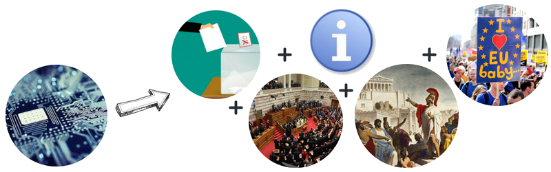

# mepwatch.eu
### informed citizens = better democracy

---
# The crisis
#### European democracy at a crossroads

notes:
- citizens increasingly disconnected from EU policy making. 
- election turnout low. 
- fake news and voter manipulations on social media.
- euroscepticism on the rise. 
- corporate capture obscuring democratic processes.

---
# The solution
Democracy works if citizens are informed and engaged.

notes:
Technology can lower the barrier to engaging meaningfully in European politics, make information accessible, improve transparency and make it easy for citizens to feed back and hold their representatives accountable for their promises - and their votes.

---

# The tool
mepwatch.eu is bringing facts back into European politics (just in time for the 2019 European election)

notes:
analyse votes and generate MEP scorecards -> inform and engage voters -> improve election turnout -> fix the European Union :)

---
# The audience

<h3>I'm a campaigner</h3>
We help you find reliable and legible voting data to support your campaign, generate simple or complex scorecards for MEPs, and engage citizens in your campaign.

<h3>I'm a citizen</h3>
We make it easy to find who represents you, score the MEP based on solid voting data instead of electoral promises, and connect with your MEP ahead of the election.

---
# The data
We analysed data for all MEPs in the 8th European Parliament's term 2014-2019.

notes:
- 7723 rollcalls 
- 5109993 individual votes
- 158453 attendance records over 237 plenary sessions
- national geodata

---
# The app generator
### how it goes:

notes:
select votes --> analyse votes and generate the app --> customise information, call to action & template messages --> set it free --> learn

---
# The app generator
[embed iframe]

---
# The scorecard app
### how it goes:

notes:
be inspired --> select the country where you vote --> filter further --> contact the MEP

---
# The scorecard app
<textarea>

 

</textarea>
---
# The stages
- First: single vote campaigns build engagement and pressure
- Second: learning and tweaking
- Third: complex multi-vote scorecards inform and engage citizens in pre-election campaigning

---
# Thank you!
### Questions?

get in touch: xavier@tttp.eu

